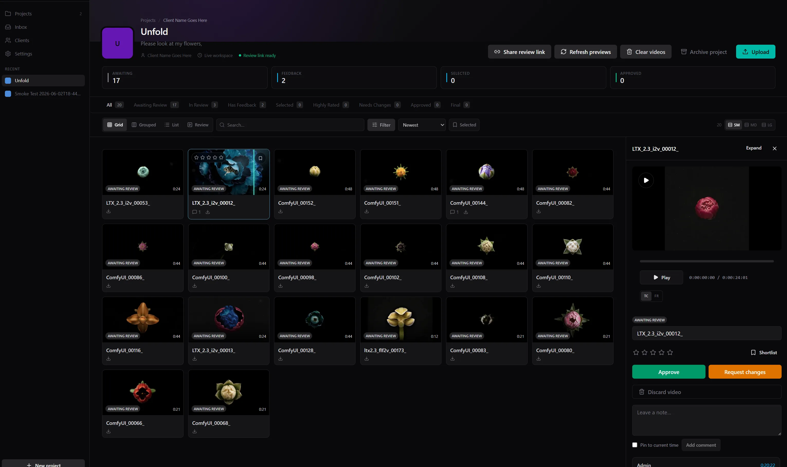

# Review Room

Client-facing video review workspace for uploading, scrubbing, shortlisting, commenting on, and approving clips.

Production: [unfold-flower-gen.app](https://unfold-flower-gen.app)

## Stack

- Next.js App Router, React, TypeScript, Tailwind CSS
- Convex for auth, project metadata, comments, ratings, and review state
- RustFS/S3-compatible storage for uploaded videos and preview assets
- Browser-generated thumbnails/scrub sprites, with an optional ffmpeg media worker fallback
- Vercel for app hosting

## Quick Start

```bash
bun install
bun dev
bun run worker:media
```

Copy `.env.example` to `.env.local` before running locally. The app expects Convex and RustFS/S3 env vars for real uploads.

## Storage

Video metadata lives in Convex. Original videos, thumbnails, scrub sprites, and project images live in RustFS through S3-compatible APIs.

## Deployment

The Vercel production URL is public, but dashboard/admin pages still require app sign-in. Client review access is handled by Review Room share links.

Production has two independent deployment surfaces:

- Vercel deploys the Next.js frontend and API routes from `main`.
- The `Deploy Convex` GitHub Actions workflow deploys self-hosted Convex whenever relevant backend files change on `main`.

For a frontend + Convex change, confirm both deployments succeed before testing the production workflow. A Vercel deployment alone does not publish Convex functions.

```bash
bun run build
bun run deploy:convex
```

Deployment notes live in [`docs/deploy-vercel-and-auth.md`](docs/deploy-vercel-and-auth.md).

## Project Docs

- [`init-docs/00-Creative-Brief.md`](init-docs/00-Creative-Brief.md)
- [`init-docs/01-PRD.md`](init-docs/01-PRD.md)
- [`init-docs/02-Design-Spec.md`](init-docs/02-Design-Spec.md)
