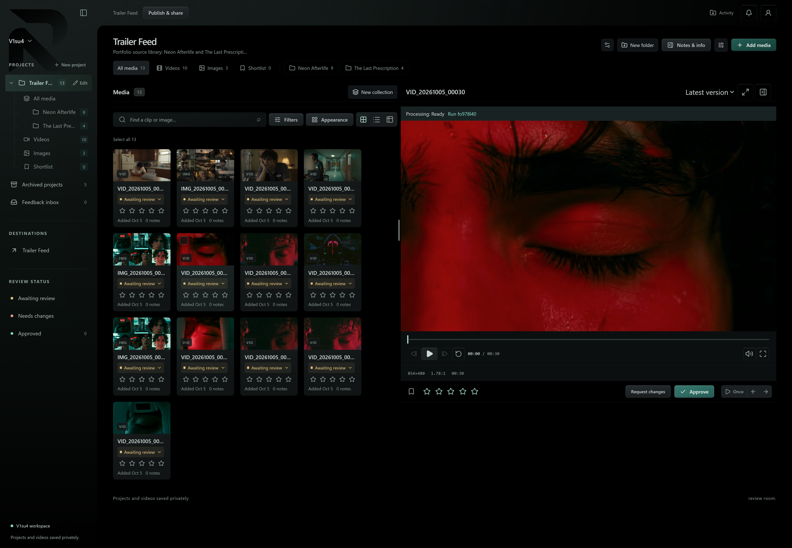

# Review Room



A media review workspace for creators and clients. Organize videos and still images, review exact versions, collect feedback, and move projects from first review to approval.

## Features

| Explore | What you can do |
| --- | --- |
| Organize&nbsp;media | Keep projects, nested folders, and collections together. Find assets with search and filters, then choose a grid, list, or table view. |
| Review&nbsp;details | Scrub video previews, adjust the playback pane, and inspect still images. Select an exact version with its prompts, model information, notes, and references. |
| Image&nbsp;annotations | Draw directly over still images with freehand marks, arrows, rectangles, and circles to show exactly what needs attention. |
| Collect&nbsp;feedback | Add comments, pin video notes to a timecode, react to feedback, and mark notes handled. Follow outstanding feedback in the inbox. |
| Approve&nbsp;work | Rate assets, build a shortlist, request changes, and approve finished work. |
| Share&nbsp;privately | Invite reviewers through scoped links, control access and downloads, and keep creator and reviewer permissions separate. |
| Batch&nbsp;uploads | Track progress, cancel or retry uploads, and generate thumbnails and scrub previews in the background. |
| Publish&nbsp;versions | Send work to Trailer Feed with delivery status, metadata refresh, and removal controls. |

## How it works

1. Create a project and organize its media.
2. Upload videos and images, then open an asset and select its version.
3. Share a review link for clients to watch, comment, rate, and approve.
4. Follow feedback in the inbox and upload revisions.
5. Publish selected versions to Trailer Feed when ready.

## Run locally

Install **Git**, **Bun 1.3.14**, and **Node.js 22**. Use a current browser that supports your media formats.

```sh
git clone https://github.com/gordo-v1su4/review-room-svelte.git
cd review-room-svelte
bun install --frozen-lockfile
bun dev
```

Open **http://127.0.0.1:5173**.

Without backend environment settings, the app opens a local preview workspace. Explore the interface and open local media; server persistence, uploads, authentication, and shared review links require the connected services.

### Connect a persistent workspace

The connected workspace uses Convex for accounts and project data, S3-compatible storage for media, and FFmpeg workers coordinated by Trigger.dev for thumbnails and scrub previews.

See [the deployment and configuration guide](docs/deploy-app-vm-and-auth.md) for this repository's maintained self-hosted setup. [`.env.example`](.env.example) lists the configuration fields; keep real credentials in private environment settings.

## Development commands

| Command | Purpose |
| --- | --- |
| `bun dev` | Start the local development server |
| `bun run check` | Check Svelte and TypeScript |
| `bun test` | Run the test suite |
| `bun run build` | Create the production build |
| `bun run preview` | Preview a production build locally |

## Built with

Svelte 5, SvelteKit, TypeScript, and Bun, with Convex, RustFS, and Trigger.dev supporting the connected workspace.

## Learn more

- [Product overview and review workflow](init-docs/01-PRD.md)
- [Deployment and configuration](docs/deploy-app-vm-and-auth.md)
- [Trailer Feed integration](docs/api/destination-sync.md)
