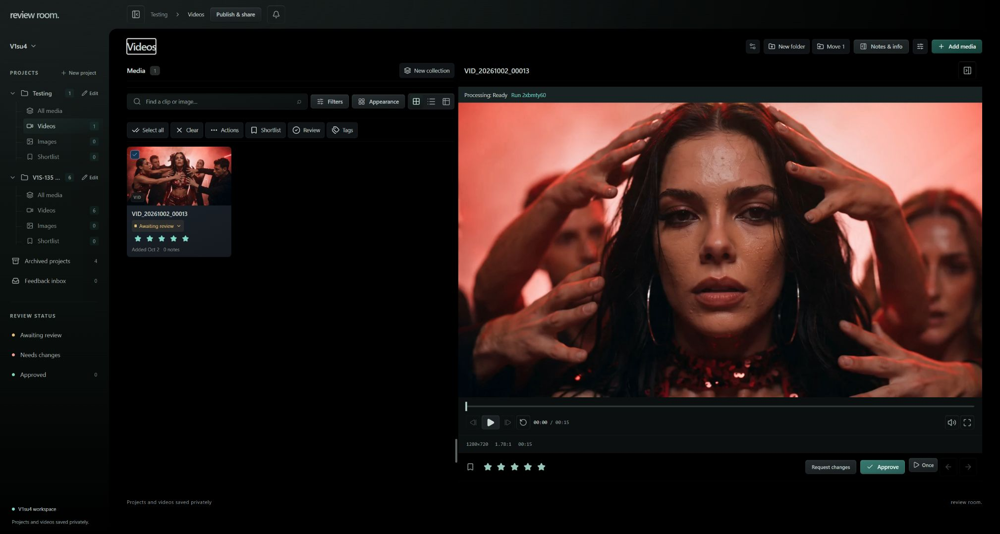
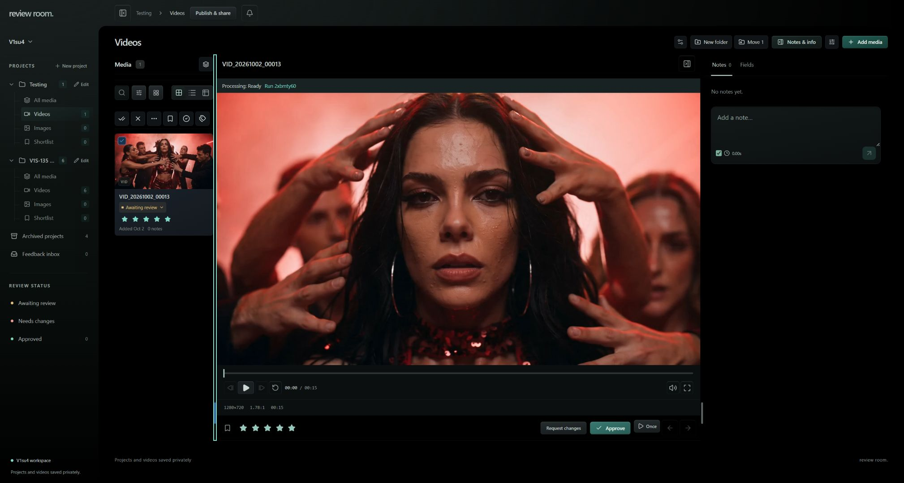
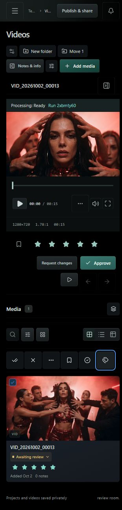
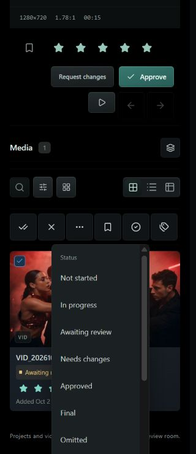

# Compact review controls — October 2, 2026

Branch `codex/compact-selection-controls` is stacked on the restored-delete branch. Deployed frontend commit: `dc67e20`. Convex and Trigger code did not change.

The selected-assets toolbar keeps one row, replacing labels with named icons below 620px of explorer width. The visible selected count and duplicate Select all row are removed while selection remains announced to assistive technology. Shortlist is one bookmark toggle; status and rating share a bounded Review menu. Blue identifies selection and bookmarks, the card checkbox is smaller with an enlarged touch target, and the tags input is 32px high. Phone toolbar targets are 44px. Frame stepping and restart move into a compact transport menu on narrow players.

Once / Loop / Order belongs alongside Previous / Next below the player, outside its transport and title. Both divider grips are 4px wide with 14px pointer targets and sit near the review outcome controls. Keyboard resizing remains available.

## Verification

- `bun run check`: zero errors, eight existing warnings; production build and App VM Docker build passed.
- `bun test`: 162 passed, 0 failed. Existing deletion/browser checks passed all four scenarios. Existing processing/browser checks passed all seven on a stable rerun; an earlier run while changes were in progress failed its stale-version assertion.
- Svelte autofixer found no new component issues; existing root initialization warnings and attachment suggestions remain.
- Live @Browser, private Testing project / `VID_20261002_00013`: at 220px explorer width all six actions share one row, with no duplicate selection row. Keyboard Home reached the minimum; a pointer drag expanded the pane to about 500px without wrapping or changing the reviewed clip. Both grips measured 4px wide at y≈898, beside Request changes at y≈941.
- Live @Browser at 320×740: six 44px selection targets share one row, the document does not exceed viewport width, and transport does not overflow its 256px content width. Review menu bounds x=84…244 stay within the phone viewport and its height is capped at 380px with internal scrolling. The tags input remains 32px high. Temporary viewport overrides were reset.
- Playback mode is in `.asset-nav`, absent from `.review-title`. Choosing Loop sets the actual viewer video's `loop` property; restored Play once afterward. The separate hidden thumbnail video was excluded from that observation.
- Live verification exposed pre-existing bulk review actions that only changed local state. They now use the same authorized owner save route as individual review actions. On synthetic clip `VID_20261002_00020`, the single toggle changed to Remove selected from shortlist, and a fresh authenticated Convex workspace query confirmed `isSelect=true`. Toggled back and confirmed `isSelect=false`; creative media was not changed for this persistence test.
- App VM container is healthy; final image `sha256:62e3799dcad17b60d99dde05d34020c8e5e133fd8842a4b50333eb0fe11b6e24`.

## Browser evidence

Rollback image: `review-room-svelte-app-app:rollback-compact-controls`; source archive `/home/gordo/review-room-pre-compact-controls.tgz`. The original pre-change rollback was retained across the frontend refinements.
