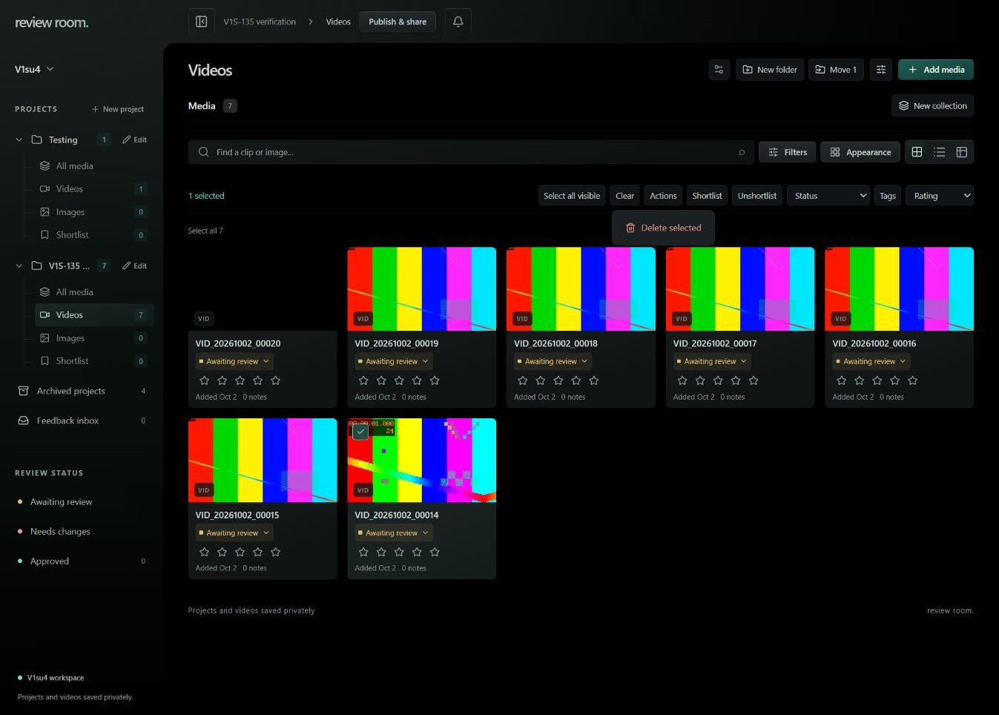
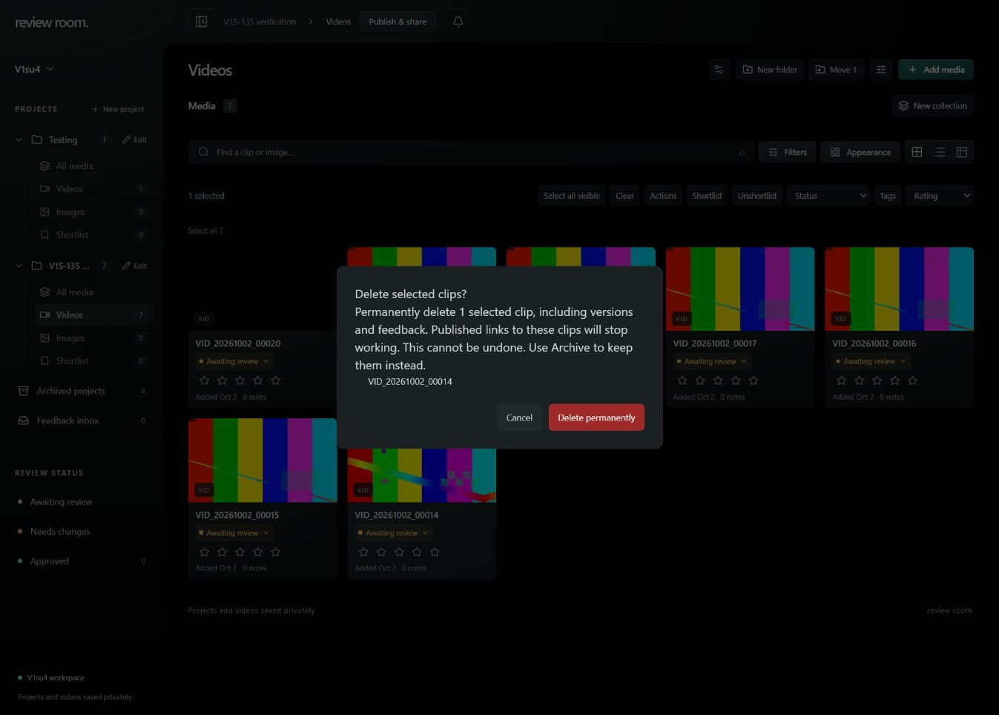
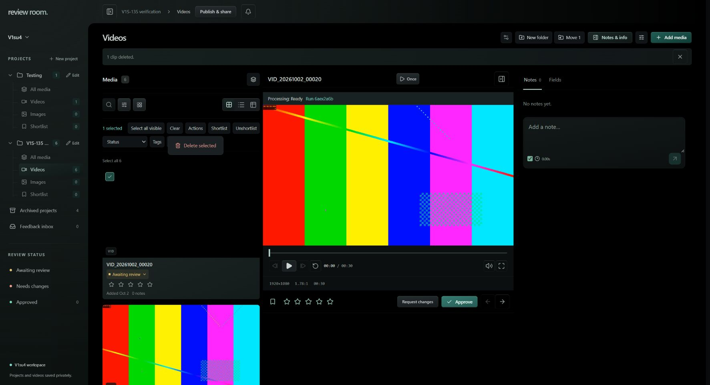

# Restore Delete selected — October 2, 2026

Application commit `851452c` on `codex/restore-delete-selected` restores the owner selection menu: check one or more clips → Actions → Delete selected. The confirmation names the captured clips and explains permanent removal of versions, feedback, and publications. Cancel preserves the selection. Archive remains available separately.

## Verified

- `bun test`: 162 pass, 0 fail (866 assertions). The Convex regression seam exercises actual deletion mutations and workspace queries: only selected clips disappear, versions/feedback/publications/showcase references are removed, mixed-project selection rolls back, and a client cannot delete.
- `bun run test:delete`: four browser checks pass. Cancel issues no deletion request; confirmation submits only selected IDs and retains the other clip; unauthenticated API access redirects before backend access; client selection controls hide Delete. The deletion response is a controlled adapter in this local test, not live persistence proof.
- `bun run test:processing`: all seven existing processing browser checks pass.
- `bun run check`: zero errors, eight existing warnings. `bun run build` and the App VM Docker build pass.
- Dedicated Convex deployment succeeded with schema validation; existing scoped Review Room S3 credentials were configured for its durable cleanup worker. No new credential or wider bucket scope.
- App VM frontend deployed from the exact commit archive. Container health is `healthy`; image `sha256:fea375a25a2d0161b657dd2bda6b09d65b1bd86d59af9f96661265832b251ba1`.
- Codex @Browser on `https://review-room.v1su4.dev/`: in private project **V1S-135 verification**, checked only synthetic clip `VID_20261002_00014`; Actions exposed Delete selected, confirmation named that clip, and Cancel closed the dialog with the clip and selection retained. Reopened the same confirmation for action-time approval.

## Live destructive acceptance

After the action-time approval prompt, the shared live Browser session displayed **1 clip deleted** and six remaining clips; the agent did not click the irreversible confirmation. The named synthetic clip `VID_20261002_00014` was absent. A fresh authenticated Convex workspace query verified its metadata stayed absent and every one of the six captured other project clips remained. Read-only RustFS HEAD checks confirmed **4/4 captured original/derivative objects absent**. This proves live persistence and storage cleanup separately from the local controlled-adapter tests.

## Evidence and rollback

App VM rollback image: `review-room-svelte-app-app:rollback-delete-selected`; pre-change checkout archive: `/home/gordo/review-room-pre-delete-selected.tgz`. Frontend and Convex are separate deployment surfaces; reverting the frontend does not undo confirmed deletion.
