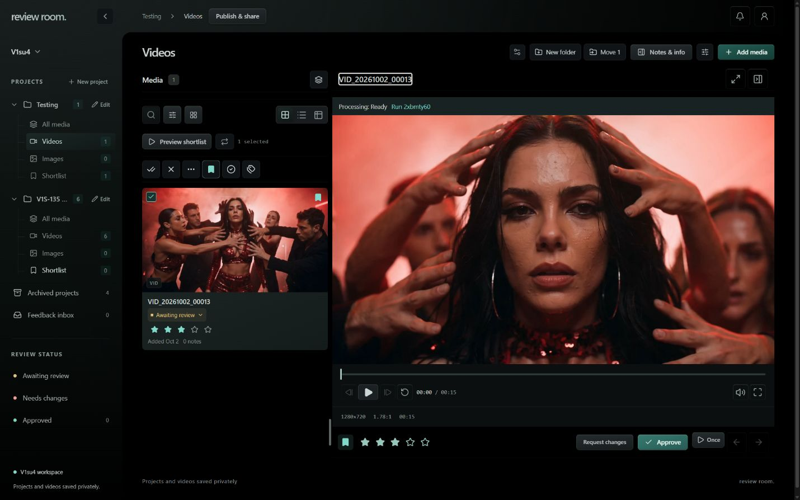
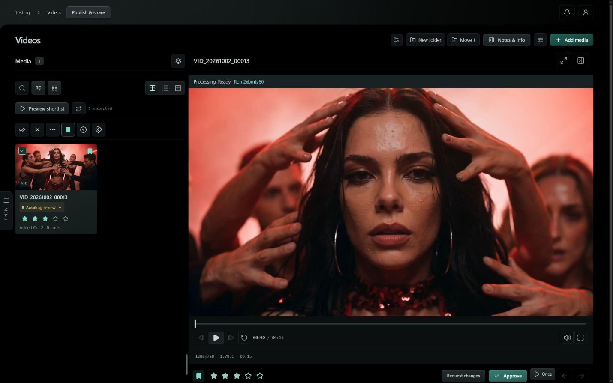
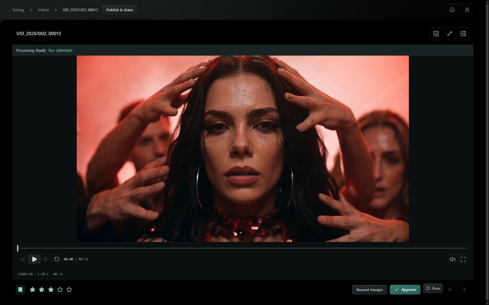
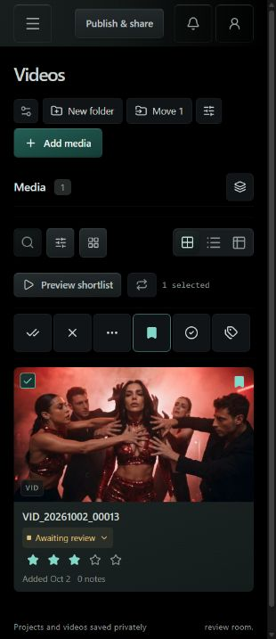
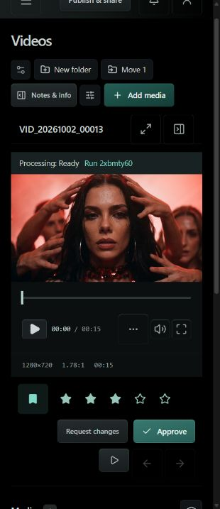

# Focused review and navigation — live verification

Verified on 2026-10-02 in the authenticated Codex in-app Browser at https://review-room.v1su4.dev/.

Frontend source: `132c06b`, branch `codex/frame-review-interactions`. Container image: `sha256:f7f7de6d4eb330766e80121312c9432b96d3855c5bf51d9c19d9599ac51939d2`. Frontend only; Convex and Trigger were unchanged.

The supplied Frame.io recording informed the side-viewer / focused-review distinction. The supplied Pindeck screenshots informed navigation collapse and the edge Menu tab. Reference media stays in ignored local verification output.

## Observed behavior

- Single-click opens the side viewer; double-click or Expand review hides the explorer and project navigation while retaining the same player.
- A seek to 1 second survived expansion and breadcrumb return. A `00013` search and checked selection survived returning to the folder. Escape also returned to browsing with the clip checked.
- Notes & info toggles the inspector in focused review.
- Hovering the explorer divider at y=220 and y=450 moved its grip to those heights. Dragging from y=450 changed explorer width and retained the active clip. The feedback divider followed y=300 and kept that height while dragged diagonally.
- The final card selector is a square teal checkbox with a check mark: 3px corner radius and `rgb(125, 217, 200)`. List selectors and table checkbox accents are teal. The overlay bookmark and Shortlist toolbar icon are both 16×16px.
- Collapse navigation sits beside the Review Room wordmark. Collapse changed the main pane's left edge to x=0 and hid the sidebar; the edge Menu tab restored it.
- Notifications and Account sit at the far right. Account opens the authenticated workspace-owner information popover. An audit of visible icon-only buttons found zero missing hover titles.
- The selection toolbar remained one row at a 220px explorer width (six 32px controls) and a 320×740 phone viewport (six 44×44px controls).
- At 1440×900, focused review actions ended at y=883. At 320×740, actions ended at y=707; document width was 310px and transport scroll width equaled its 246px client width. Feedback may scroll below the main review controls on phones.

## Checks

- `bun run check`: 0 errors; 8 existing warnings.
- `bun test`: 162 passed, 0 failed, 866 assertions.
- Local production build and final App VM Docker production build passed.
- Svelte autofixer checked every touched component; remaining suggestions concern existing effects, collections, or element bindings.
- Temporary Browser viewport overrides were reset. Unrelated untracked backlog and runtime-cache paths were preserved.

## Screenshots

