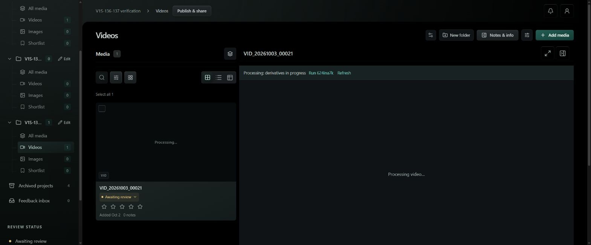
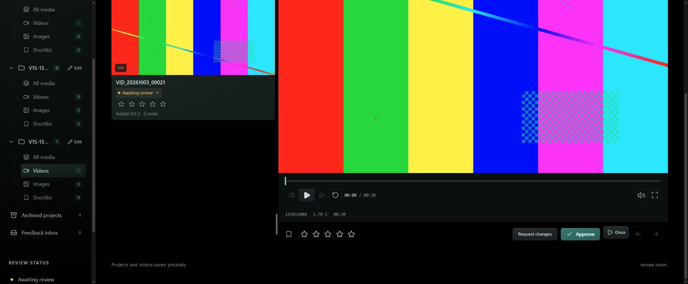
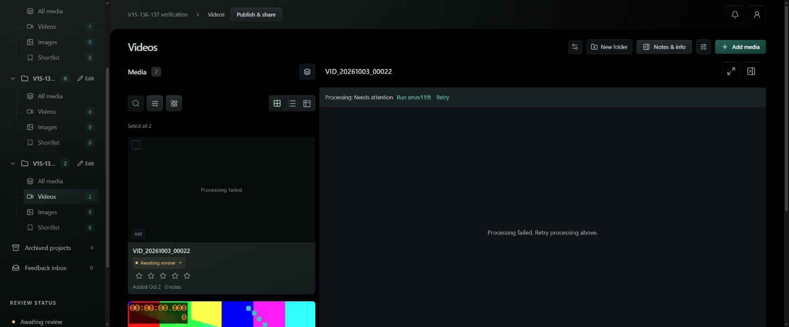
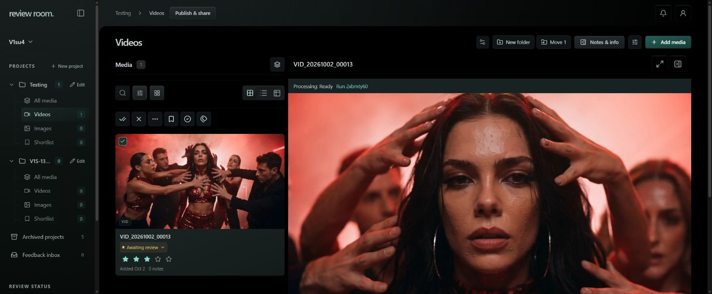
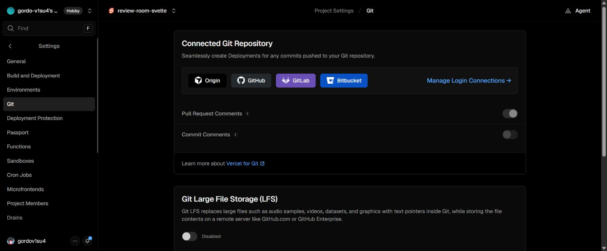

# V1S-136 / V1S-137 — deployed verification

Verified October 2, 2026 (Eastern) in the Codex in-app Browser at `https://review-room.v1su4.dev`. [PR #12](https://github.com/gordo-v1su4/review-room-svelte/pull/12) contains the implementation and reproducible checks. Runtime source: `66147f2`; App VM frontend image: `sha256:32ac3e91df0c3f9b15703be3bfcdaef5cae63c21e56258cf60319d5d44c283e4`, healthy. The dedicated Convex backend was deployed separately to `https://review-convex.v1su4.dev`; Trigger and RustFS configuration were unchanged.

## Processing and recovery

- A real browser upload to the isolated private `V1S-136-137 verification` project displayed a processing card and “Processing video…” in its open review. The native video had no source while gated. It then decoded and played 1920×1080 video automatically. The document loader remained `3FAF3FEB1C12054BC2D2AC5606AD97DA` throughout the transition: no reopening or page reload.
- A synthetic invalid video caused an actual worker failure. The deployed UI displayed “Processing failed” with Retry, rather than a broken poster or codec message. Retry dispatched attempt 2 and returned to processing. The invalid source correctly failed again; retry cannot repair corrupt source bytes. One request during container replacement received 502; retry after the healthy deployment dispatched successfully.
- An approved synthetic clip was replaced through the authenticated deployed upload APIs. Media returned 404 while the new version processed, then became playable in the same open review at 320×180 / four seconds. Its version URL and ETag changed. `If-Range` with the old ETag returned the complete new 118,817-byte version, as HTTP requires; ordinary replacement ranges returned only 65,536 bytes.
- Controlled browser regression checks cover queued/running, ingest retry-to-ready, unavailable media, expired access, retry recovery, missing posters, and an actual `MediaError.code === 3` from a corrupted MP4. These injected transport/decoder failures are local regression evidence, distinct from the real production upload/failure/replacement proof above.
- Early review remains gated until both the asset and its current version are ready. The policy is recorded in the design spec.

## Private delivery and access

The proxy retains fresh authorization before selecting a storage key. Version-key bytes use a 64 MiB LRU cache with five-minute TTL and entries up to 16 MiB; background fills are also bounded. Responses stream immediately, including cache hits. Permissions are never stored in this cache. Browser responses use `private, no-cache`, ETags and normal range responses.

Production checks (`scripts/check-deployed-media.mjs`, executed inside the existing App VM runtime with its existing dedicated credentials) passed:

- Anonymous owner media redirects to sign-in; invalid and wrong-project review tokens return 404.
- Valid private ranges return 206 and exact bytes; HEAD returns the full length; ETag validation returns 304; malformed ranges return 416.
- Revoked and expired review tokens return 404 after the byte cache has been warmed.
- A synthetic publication was warmed on the old version, replaced, and returned the new version's ranged bytes and ETag. Revocation then returned 404. All synthetic links and the publication were revoked.

The live expiry test initially reproduced an existing Convex query-cache issue: a timestamp alone does not invalidate a cached query when a token expires. Media review queries now include the current request timestamp, forcing expiry to be re-evaluated. Both the backend and frontend changes were deployed before repeating the passing test.

Thirty-second signed direct delivery was measured as a read-only alternative. It returned 403 after expiry and 206 after renewal. It is faster but preserves bearer access until expiry following revocation, so the selected path remains the proxy. No bucket exposure or new credential was introduced. Private signed URLs were excluded from Git and removed from local evidence.

## Measurements and limits

Same clip: `VID_20261002_00013`, 9,248,651 bytes, 1280×720, 15 seconds. Windows Chrome 154 in-app Browser, unthrottled existing network, same frontend/storage endpoints, no concurrent uploads during the final run. Five cold/warm pairs per path; raw results are in [media-delivery-samples.json](evidence/media-delivery-samples.json).

“Cold” means a newly created native decoder and first poster load in a pair; “warm” is its immediate repeat. It does **not** mean OS/RustFS caches were flushed. HTTP cache was disabled through CDP; Chrome still reuses already-decoded images on immediate repeats. Final cold poster URLs vary a harmless query parameter to ensure a fresh image request; storage-key caching and authorization remain unchanged. The baseline used `no-store` and performed fresh poster requests already.

The delivery harness measures from assigning the authorized source to poster load / native canplay, then seeks to 80% and times an explicit range response. It isolates transport from UI rendering. A separate ten-click deployed UI run measured actual pointer-down → canplay: median **246.4 ms**, all ten reached native readyState 4. The card poster was already loaded before those clicks. No pre-change UI-click baseline was captured; source-assignment timing must not be presented as full click-to-player timing.

| Median, ms (all ten samples) | Previous proxy | Direct signed candidate | Final proxy |
| --- | ---: | ---: | ---: |
| Poster load | 63.0 | 16.8 | 12.5 |
| Source assignment → canplay | 223.7 | 93.9 | 216.3 |
| Seek completion | 230.5 | 108.7 | 177.7 |
| Explicit range TTFB | 62.6 | 23.1 | 29.8 |

Direct signing/authorization added 152.1 ms before source assignment and is excluded from the direct column. The final proxy improved aggregate medians, especially repeat posters and range TTFB. Canplay improvement is modest (~3%) and sample distributions overlap; this is not a statistically established speed guarantee. Cold poster median was 65.6 ms versus 61.5 ms before (a small regression), while immediate warm poster median fell from 64.4 ms to 0.4 ms. Cold canplay was 216.0 ms and warm 216.6 ms. An initial 1 MiB range experiment worsened seeking and was rejected; final ranges are bounded at 16 MiB and stream rather than wait for buffering.

The browser actually requests `/api/owner-poster/...` and decodes the generated **640×360 JPEG** for this clip. Generated sprite sheets are not used by the owner UI: hover previews still extract native-video frames into a bounded canvas cache. The PRD documents that distinction.

## Release checks and cleanup

- `bun test`: 166 pass, 0 fail, 888 assertions; type check: 0 errors, eight existing warnings; production Docker build passed.
- Processing and deletion regression suites passed; media-state browser suite passed all five checks. The added streaming test ensures the first bytes arrive before the full object is available.
- Vercel project Git settings explicitly show **not connected to a Git repository**. No Vercel status/check/deployment was created by the branch push. The application is self-hosted; Vercel remains disconnected.
- Synthetic project archived (recoverable), all test review links/publication revoked, original Testing clip's rating and shortlist preserved. Browser cache settings restored.
- Rollback source: `/home/gordo/review-room-pre-media-fixes.tgz`; frontend image tag: `review-room-svelte-rollback:pre-media-fixes`. The backend timestamp argument is optional and compatible with the prior frontend.

