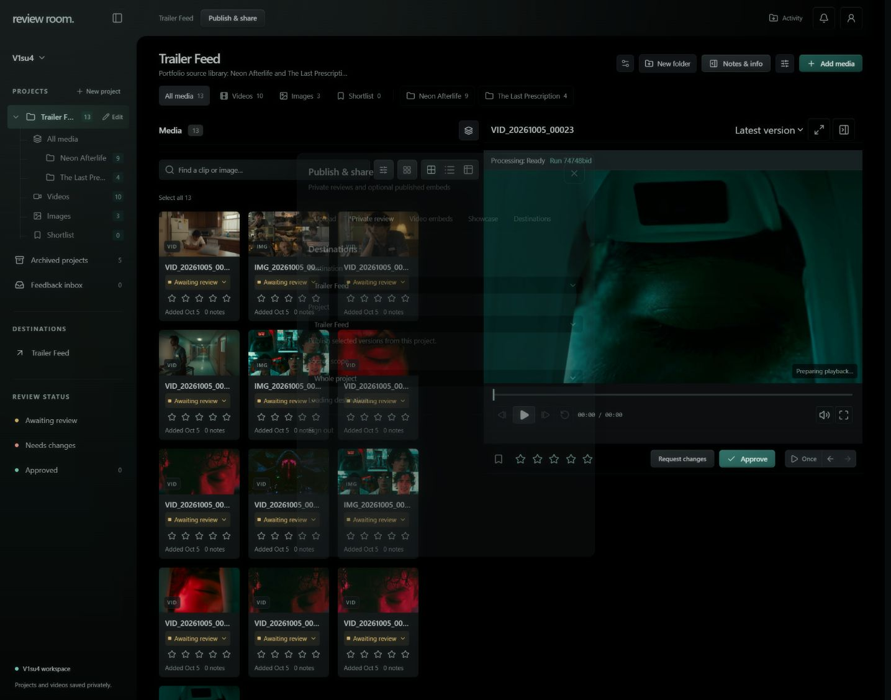

# Review Room release closeout — October 7, 2026

The owner accepted the delivered personal release and requested all remaining Linear items closed. All 25 issues in the selected-version sync project are Done. Physical iPhone Safari, Android Chrome, independent Edge and phone sign-out checks were not performed; they remain documented coverage limits rather than claimed test passes.

One [application PR16](https://github.com/gordo-v1su4/review-room-svelte/pull/16) merged after Greptile **5/5** on exact candidate `cc2afcb`. The same combined native reviewer covered both repositories. All eight findings were fixed; 225 tests and 1,246 assertions passed. Deployment identities and rollback points are recorded in the canonical `proxmox-home/docs/endpoint-index.md`.

## Clean workspace

Five agent-created synthetic QA projects were archived through the existing project operation. They remain recoverable under the normal archive policy. The live sidebar now contains only Trailer Feed; the canonical project's 13 assets, versions, folders and project record are unchanged by digest. Its feedback inbox has zero open notes.

## Existing password protection

The owner workspace already requires a signed server-side owner session. An anonymous request redirects to sign-in. On the deployed release, the existing shared operator password was verified with the owner email; a signed private read succeeds, and Sign out deletes the owner cookie. Sign out is available in the top-right Account/person menu.

Public repository visibility exposes source code, not a logged-in app session. Runtime credentials come from protected server environment variables; password values were neither printed nor committed during this closeout. Intentionally enabled private review links and published embeds have their own existing access rules. This is not a repository-history secret audit or a claim that every shared link requires the owner's password.

The password-only “Use current owner password” shortcut uses a separate owner/bootstrap credential. The shared operator password is verified through the normal email sign-in; no password or authentication system was changed.

The [delivery/deletion Mermaid diagram](../api/destination-sync.md#delivery-and-deletion-flow) is saved in the owning API guide. These screenshot/documentation updates are pushed directly to main at the owner's request.
