# Review Room — Client How-To

Guide for shared clients / guest reviewers on https://unfold-flower-gen.app.

**How this doc is written (ftrack-style):**
- Instructions live in this text so they stay searchable.
- Screenshots are tight crops of the control you need — not full zoomed-out pages with a vague box.
- Images may have one teal box + arrow, or plain teal numbers (font ~40, no circles).
- Do not bake step copy into the PNGs.

**Outline:** https://outline.serving.cloud/doc/review-room-client-how-to-tyvVldHFgb

---

## What clients can do

| Action | Client / guest | Admin |
|---|---|---|
| Browse folders + smart views | Yes | Yes |
| Rate / shortlist / comment | Yes | Yes |
| Draw markup on stills | Yes | Yes |
| **Upload media** (e.g. into References) | **Yes** | Yes |
| **Mark for delete** (flag for admin removal) | **Yes** | Yes |
| Create / rename / delete folders | No | Yes |
| Permanently delete media / clear / archive | No | Yes |

---

## 1. Sign in

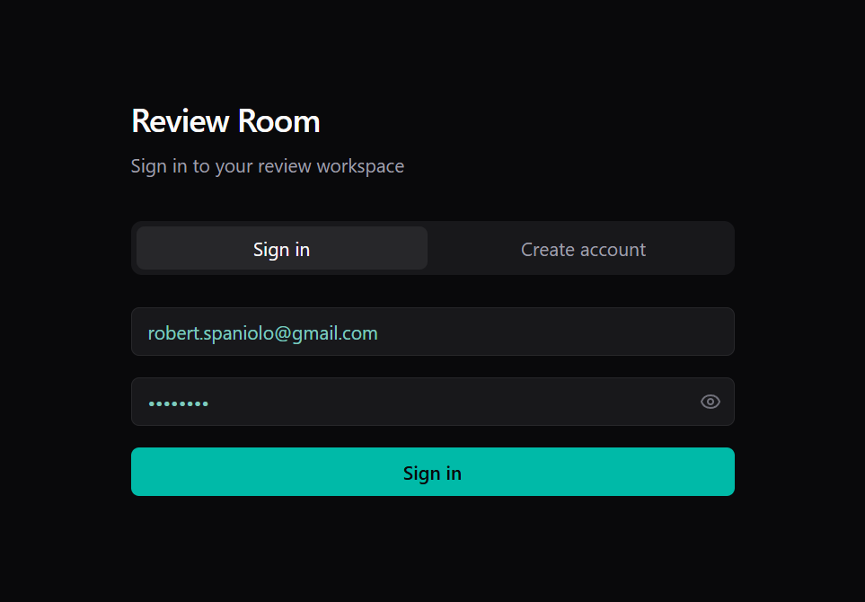

1. Open the Review Room link you were given.
2. **Create your account** (register) with the email your team shared — even if production already set you up, you still complete this once.
3. Enter that email + password and click **Sign in**.

You land on **Projects** — only projects shared with you appear.

---

## 2. Projects home

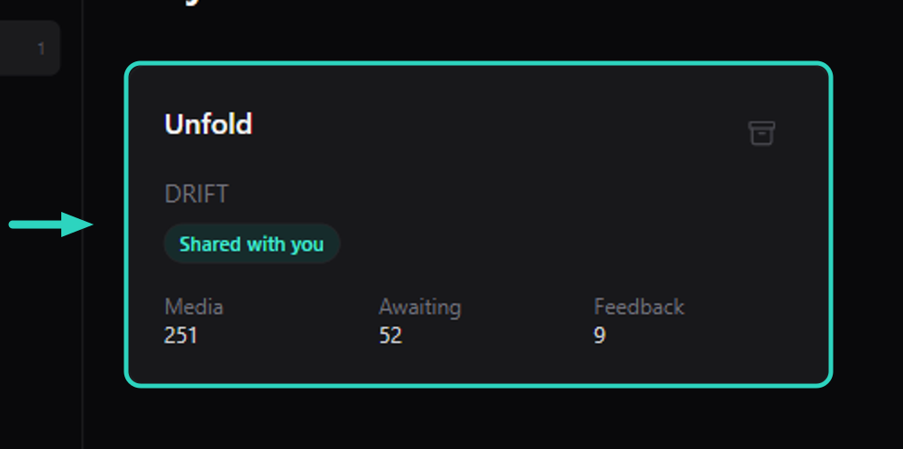

Only projects shared with you appear here. Click a project card to open the workspace.

**Tip:** The badge **Shared** means you are a reviewer on this project. If you have several projects, you will see multiple cards on this page.

---

## 3. Project overview

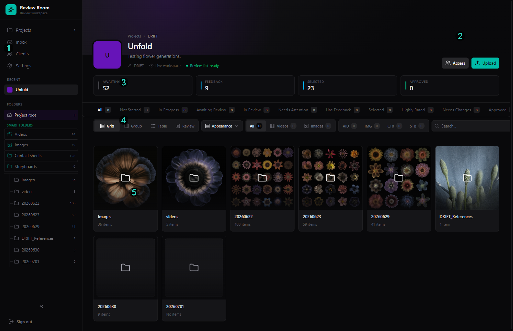

This is the full project workspace. Numbers on the image match:

1. **Left** — Projects, **Inbox**, smart folders, and date folders
2. **Top right** — **Access** and **Upload**
3. **Status cards** — Awaiting, Feedback, Selected, Approved
4. **Smart view tabs + toolbar** — filter the set; Grid / Group / Table / Review, Appearance, Search
5. **Main area** — folder cards or media cards

Open a smart folder or date folder to start reviewing.

---

## 4. Upload media

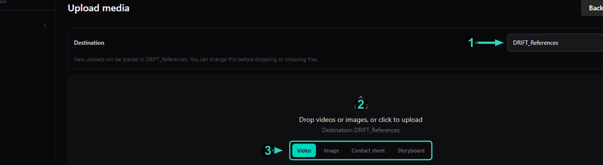

Click **Upload** in the project header (overview **2**).

1. **Destination** — pick a folder. Use **DRIFT_References** (or your references folder) for reference stills, or today's date folder for new review media.
2. **Drop zone** — drop files here, or click to choose them.
3. **Asset type** — choose before uploading:
   - **Video** — motion clips
   - **Image** — single stills
   - **Contact sheet** — grids / sheets
   - **Storyboard** — storyboard frames

Large videos are uploaded in smaller parts automatically. Keep the Review Room tab open until the file shows **Done**.

---

## 5. Browse media

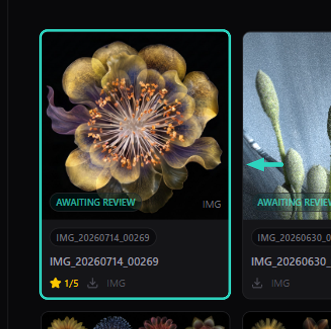

1. Click **Images** (or Videos / Contact sheets) under Smart folders.
2. **Click** a card to open the **details panel** on the right.
3. **Double-click** a still to open the **full-size view**.

---

## 6. Appearance

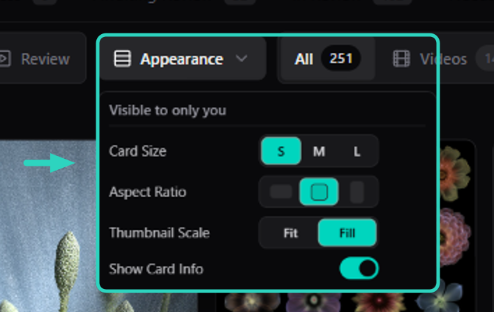

Open **Appearance** to change how the grid looks for you:

- **Card size** — S / M / L
- **Aspect ratio** — landscape / square / portrait
- **Thumbnail scale** — Fit or Fill
- **Show card info** — turn off to hide titles and badges under cards

These settings are saved for your browser on this workspace.

---

## 7. Selected (your shortlist)

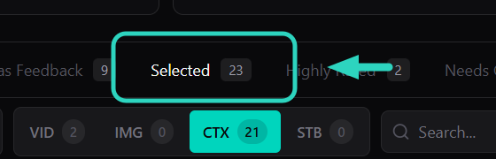

Click the **Selected** smart view tab to see only the assets you shortlisted.

To add something to Selected, open an asset and click **Shortlist** (bookmark) in the details panel.

---

## 8. Has Feedback

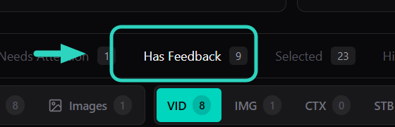

Click **Has Feedback** to jump to assets that already have notes or comments.

---

## 9. Rate, shortlist, comment, and mark for delete

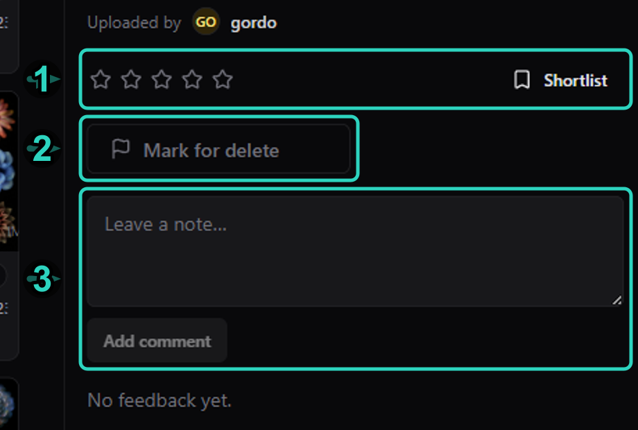

After you click a card, the details panel opens on the right.

1. Rate with the **stars**, or click **Shortlist** (bookmark) to save a pick.
2. Type in **Leave a note…**, then click **Add comment**.
3. If you uploaded something by mistake, or want an asset removed, click **Mark for delete**. That flags it for the production team — they handle the actual delete. You cannot permanently delete media yourself.

---

## 10. Video review

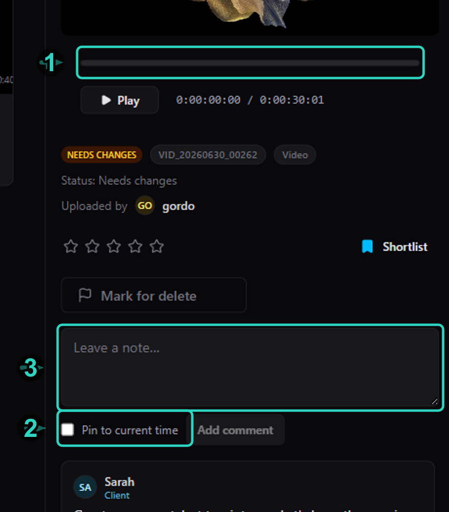

1. Scrub the **timeline** under the preview (number **1**) to find the moment you care about.
2. Optionally turn on **Pin to current time** (number **2**) so the note sticks to that timecode.
3. Type the note and click **Add comment**.

---

## 11. Draw-overs (stills)

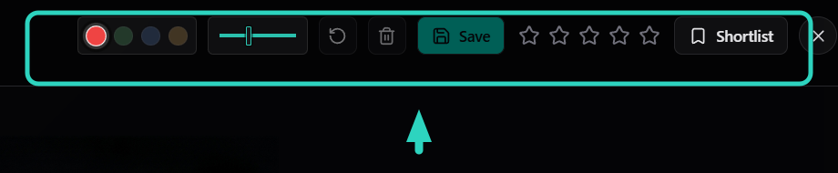

On stills (**IMG / CTX / STB**):

1. Hover a card and click **Markup**, or double-click the still for the full-size view and draw there.
2. Pick a **color** and **stroke thickness**, then draw.
3. Use **Undo** or **Clear** if needed.
4. Click **Save**.
5. You can also **rate with the stars** in the same toolbar.

---

## 12. Table view

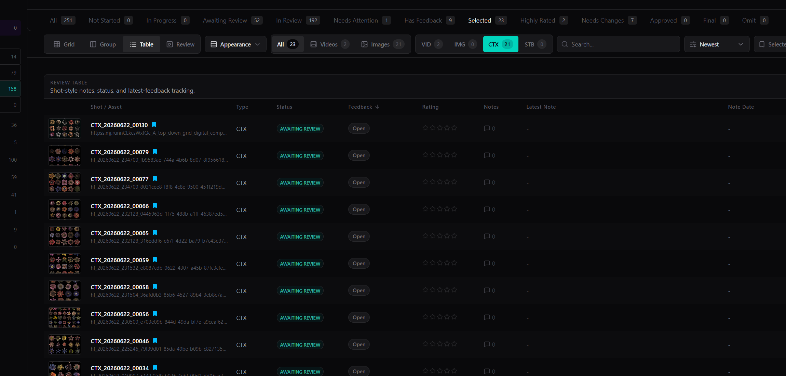

Switch the toolbar to **Table** for a spreadsheet-style list (Shot, Status, Feedback, Rating, Updated, and more). Sort columns by clicking headers.

---

## 13. Inbox

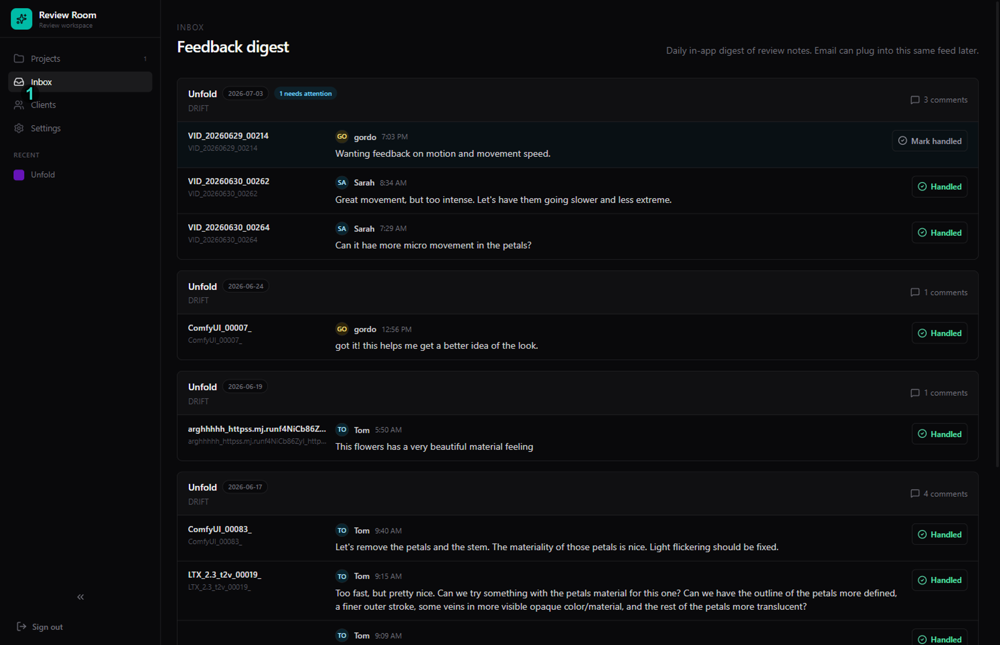

Open **Inbox** from the left sidebar (number **1** on the image). It is the cross-project digest of review notes.

- Grouped by project and day
- Shows who wrote what, and on which asset
- **Needs attention** when something still needs follow-up
- **Mark handled** when you are done

---

## Typical client loop

1. Register → Sign in → open the shared project.
2. (Optional) **Upload** into References or today's date folder.
3. Open **Images**, **Videos**, or a date folder.
4. Click a card for the details panel (double-click a still for full-size).
5. Rate + Shortlist favorites.
6. Leave notes (pin to time on video).
7. Markup stills and Save.
8. **Mark for delete** anything that should be removed.
9. Check **Selected** / **Has Feedback** / **Inbox**.

---

## What clients cannot do

- Create / rename / move folders or folder covers
- Permanently delete media (use **Mark for delete** instead)
- Clear media / refresh previews / archive project
- Edit project identity / banner
- Change project Access membership

---

## Regenerate annotated plates

```bash
bun documentation/notion-client-guide/annotate-ftrack.ts
```
