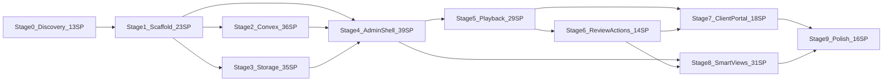

# Review Room — MVP delivery plan

> Historical plan for the former app. The standalone Svelte deployment contract is in `docs/adr/001-infrastructure.md` and `docs/deploy-app-vm-and-auth.md`; the Next.js/Vercel steps below are not current instructions.

**Source of truth:** [init-docs/00-Creative-Brief.md](init-docs/00-Creative-Brief.md), [init-docs/01-PRD.md](init-docs/01-PRD.md), [init-docs/02-Design-Spec.md](init-docs/02-Design-Spec.md)

**Current state:** Application code is active in this repo. MVP stages are implemented on the Review Room app stack per PRD §3, with **your homelab infra overriding cloud defaults** (see Infrastructure section below). Use this plan as delivery/history guidance and keep PRD/Design Spec as the product source of truth.

**Story points:** Fibonacci (1, 2, 3, 5, 8, 13). Relative complexity for one experienced dev/agent session, not calendar days. **MVP total: ~171 SP** across 10 stages (~6–9 two-week sprints at 20–30 SP/sprint if executed sequentially).

**Your choices baked in:**

- **Grouped view** — in MVP (Design Spec §3 optional → included).
- **Auth** — Phase 0 spike: default path is **Convex Auth** (pindeck pattern, one vendor); escalate to **Clerk** if the spike finds gaps (social login, richer session UX, faster admin onboarding). **WorkOS** is out of MVP scope (enterprise SSO overkill).
- **Self-hosted backends** — **Convex** and **RustFS** on your homelab (already working in pindeck). Do **not** provision `*.convex.cloud`, temporary S3, MinIO-in-docker, or other throwaway endpoints for MVP. Copy env wiring and deployment patterns from pindeck.

---

## Infrastructure — self-hosted homelab (canonical: pindeck)

The init-docs mention Vercel + `*.convex.cloud` and “local RustFS” as a dev default. **For this project, pindeck is the source of truth** for how Convex and RustFS are wired to your self-hosted stack.

| Layer              | MVP target                                                                          | Do not use                                                                        |
| ------------------ | ----------------------------------------------------------------------------------- | --------------------------------------------------------------------------------- |
| **Convex**         | Your self-hosted Convex deployment URL (from pindeck: `CONVEX_URL` / deploy config) | Convex Cloud dev/prod projects unless you explicitly opt in later                 |
| **Object storage** | Your homelab **RustFS** S3-compatible endpoint, bucket, and keys (path-style)       | AWS/R2/MinIO temp buckets, docker-only RustFS stand-ins, or placeholder endpoints |
| **Secrets**        | `.env.local` / server env — homelab values only; never committed                    | Checked-in URLs, keys, or presigned URLs                                          |
| **Worker**         | Same always-on homelab worker pattern as pindeck (ffmpeg thumbnails/sprites)        | Vercel serverless for heavy media jobs                                            |
| **Frontend**       | Next.js on Vercel (or local `bun dev`) pointing at homelab Convex + presign API     | —                                                                                 |

**Stage 0 deliverable (0.2 + 0.4):** Extract from pindeck and document in ADR + `.env.example`:

- Convex: deployment URL, auth config, `convex dev` / deploy commands against self-hosted
- RustFS: `S3_ENDPOINT`, `S3_REGION`, `S3_BUCKET`, `S3_ACCESS_KEY_ID`, `S3_SECRET_ACCESS_KEY`, `S3_FORCE_PATH_STYLE=true`
- Any reverse-proxy / TLS / Tailscale hostname rules so Vercel and local dev can reach homelab APIs
- CORS on RustFS (if applicable) for browser PUT to presigned upload URLs

**PRD doc follow-up (when executing):** Add a short infra note to [init-docs/01-PRD.md](init-docs/01-PRD.md) §3 / §7 clarifying self-hosted Convex + homelab RustFS as the default, with pindeck as reference — without changing the storage abstraction design.

---

## Product summary (from docs)

| Dimension     | MVP                                                                                           | Deferred (Phase 2)                                                                            |
| ------------- | --------------------------------------------------------------------------------------------- | --------------------------------------------------------------------------------------------- |
| Core loop     | Upload → grid cards → right panel playback → rate/shortlist/comment → Approve/Request Changes | freecut WebCodecs engine, List view, version stacks, exports, expiring links, branding themes |
| Organizing    | Metadata-driven smart-view tabs; optional drag sets mapped fields only                        | Saved custom views, activity log                                                              |
| Playback      | HTML5 + signed URL + ffmpeg sprite scrub (Phase A)                                            | Phase B freecut port behind same player interface                                             |
| Client access | Share link or shared signed-in workspace; display name on first action                        | Email notifications, richer teams/orgs                                                        |
| Feedback      | Comments, author initials, small reactions, Mark handled, in-app Inbox, Table action board    | Scheduled daily digest worker, email delivery, AI/manual note summaries                       |
| Organization  | Flat date folders, smart type folders, immutable asset codes, admin folder covers             | Custom bundles/playlists, version stacks                                                      |

**North star (non-negotiable):** Dark, editorial, cinematic; video is hero; not spreadsheet/Kanban/task-manager. **Modeling rule:** `status` is workflow only; facets (`viewed`, `rating`, `isSelect`, `commentCount`) drive smart views — never collapse into status.

---

## Stage map and story points

---

### Stage 0 — Discovery and ADR (13 SP)

**Goal:** Align folder structure, conventions, and auth/worker patterns before writing product code.

| ID  | Story                                                                                                                                 | SP  | Owner doc      |
| --- | ------------------------------------------------------------------------------------------------------------------------------------- | --- | -------------- |
| 0.1 | Inspect `gordo-v1su4/project-stack-structure` — app layout, naming, env patterns                                                      | 2   | Brief §refs    |
| 0.2 | Inspect `gordo-v1su4/pindeck` — **self-hosted Convex URL/deploy**, **homelab RustFS env**, Convex Auth, presign routes, worker deploy | 3   | Brief §refs    |
| 0.3 | Inspect `gordo-v1su4/freecut` — **preview/scrub module only**; note interface for Phase B                                             | 3   | PRD §8         |
| 0.4 | Write ADR: auth choice, worker topology, **homelab endpoint map** (Convex + S3), CORS/TLS notes for Vercel ↔ homelab                  | 2   | PRD §3, §7, §9 |
| 0.5 | Produce `.env.example` cloned from pindeck variable names; values filled from your homelab (not cloud templates)                      | 3   | Infra §        |

**Exit:** ADR committed; `AGENTS.md` Commands/Architecture/Conventions sections drafted.

**Parallel agents (3):** One repo each (0.1, 0.2, 0.3) — no shared gate except 0.4 merges findings.

---

### Stage 1 — Scaffold and design foundation (23 SP)

**Gate:** Stage 0 ADR approved.

| ID  | Story                                                                                                         | SP  |
| --- | ------------------------------------------------------------------------------------------------------------- | --- |
| 1.1 | Next.js App Router + TS + Tailwind; routes skeleton per PRD §10                                               | 5   |
| 1.2 | shadcn/ui init; base Button, Input, Dialog, Popover, Tabs                                                     | 3   |
| 1.3 | Convex init wired to **self-hosted deployment** (pindeck `convex.json` / deploy scripts / `CONVEX_URL`)       | 3   |
| 1.4 | Design tokens: zinc ramp, semantic palette, brand vs semantic separation (Design Spec §11)                    | 5   |
| 1.5 | `AppShell` — top nav, dashboard layout shell                                                                  | 5   |
| 1.6 | `.env.example` + README: homelab `S3_`* + self-hosted Convex URLs; document `bun dev` reachability to homelab | 2   |

**Exit:** `bun dev` runs; empty routes render inside dark shell.

**Parallel after 1.1:**

- Agent A: 1.2 + 1.3
- Agent B: 1.4 + 1.5
- Agent C: 1.6 (depends on env keys from ADR)

---

### Stage 2 — Convex data layer (36 SP)

**Gate:** 1.3 complete.

| ID  | Story                                                                                         | SP  |
| --- | --------------------------------------------------------------------------------------------- | --- |
| 2.1 | Schema: `users`, `projects`, `videos`, `comments`, `reviewLinks` per PRD §5 sketch + indexes  | 5   |
| 2.2 | `projects.`* — create, list by creator, get by id/slug, archive                               | 5   |
| 2.3 | `videos.*` — CRUD, defaults on upload (§6), order field                                       | 5   |
| 2.4 | Facet transitions — first play → `viewed`; rating; `isSelect` toggle; approve/request changes | 8   |
| 2.5 | `comments.*` — insert, list by video, increment `commentCount`                                | 5   |
| 2.6 | `reviewLinks.*` — create token, optional passcode hash, validate token query                  | 5   |
| 2.7 | Admin auth — Convex Auth (or Clerk if ADR says so); role `admin` on `users`                   | 3   |

**Exit:** Convex dashboard shows tables; mutations tested via Convex dashboard or thin test harness.

**Parallel:** 2.2 and 2.6 can start after 2.1; 2.4 after 2.3; 2.7 parallel with 2.2–2.6 once auth provider chosen.

---

### Stage 3 — Storage and media worker (35 SP)

**Gate:** 1.1 complete (API routes exist).

| ID  | Story                                                                                                          | SP  |
| --- | -------------------------------------------------------------------------------------------------------------- | --- |
| 3.1 | S3 abstraction — presign upload/download, delete, path-style for RustFS                                        | 5   |
| 3.2 | `POST /api/storage/presign-upload` — server-side keys only                                                     | 3   |
| 3.3 | `POST /api/storage/presign-download` — respects `downloadEnabled`                                              | 3   |
| 3.4 | Homelab RustFS smoke test — presign PUT/GET against **your** `S3_ENDPOINT` (path-style); no docker/temp bucket | 5   |
| 3.5 | Always-on **homelab** worker (pindeck pattern) — same network access to RustFS + Convex as pindeck             | 5   |
| 3.8 | CORS + TLS check — browser upload to presigned URL and playback signed GET from client review page             | 3   |
| 3.6 | Thumbnail job — ffmpeg frame → `thumbnailKey` on video                                                         | 8   |
| 3.7 | Sprite sheet job — scrub preview → `spriteKey` (PRD Phase A playback)                                          | 8   |

**Exit:** Upload file lands in bucket; Convex video row gets keys; card can show thumbnail when job completes.

**Parallel:** 3.1–3.4 (Agent Infra) vs 3.5–3.7 (Agent Worker) after 3.1; 3.6 and 3.7 parallel inside worker track.

**Critical path note:** Grid can show placeholders until 3.6/3.7 complete; MVP acceptance requires scrub preview working (AC #2–3).

---

### Stage 4 — Admin workspace shell (39 SP)

**Gate:** 2.x + 3.1–3.4 minimum (upload path works).

| ID  | Story                                                                           | SP  | Component (Design Spec §12) |
| --- | ------------------------------------------------------------------------------- | --- | --------------------------- |
| 4.1 | `/dashboard` project list — cards with counts (awaiting review, feedback, etc.) | 5   | —                           |
| 4.2 | `/dashboard/projects/new` create flow                                           | 3   | —                           |
| 4.3 | `/dashboard/projects/[projectId]` shell — header route                          | 2   | `ProjectHeader`             |
| 4.4 | `ProjectBanner` + share CTA placeholder                                         | 5   | `ProjectBanner`             |
| 4.5 | `VideoCard` — all states, scrim, pills, hierarchy (Design Spec §6)              | 8   | `VideoCard`                 |
| 4.6 | `VideoGrid` — responsive columns, size toggle                                   | 5   | `VideoGrid`                 |
| 4.7 | `UploadDropzone` — multi-file, per-file progress states                         | 8   | `UploadDropzone`            |
| 4.8 | Wire upload: presign → PUT → Convex video row → grid optimistic update          | 3   | —                           |

**Exit:** Admin can create project, upload videos, see cards (thumbnail when ready).

**Parallel (high leverage):**

- Agent UI: 4.5 + 4.6 with **mock Convex data** (starts day 1 of stage)
- Agent Pages: 4.1–4.4
- Agent Upload: 4.7 + 4.8 (needs 3.x)

---

### Stage 5 — Playback and details panel (29 SP)

**Gate:** 4.8 + 3.7 (sprite) for full scrub; player can ship with HTML5 first.

| ID  | Story                                                                     | SP  | Component           |
| --- | ------------------------------------------------------------------------- | --- | ------------------- |
| 5.1 | `VideoPlayer` — HTML5, signed URL, persistent controls                    | 5   | `VideoPlayer`       |
| 5.2 | Sprite scrub — hover preview + seek bar (no WebCodecs in MVP)             | 8   | `VideoPlayer`       |
| 5.3 | `VideoDetailsPanel` — closed / open / expanded states                     | 8   | `VideoDetailsPanel` |
| 5.4 | Panel fields: title, `VideoStatusPill`, tags, rating, shortlist, download | 5   | + controls          |
| 5.5 | Card select ↔ panel open; grid reflow; first-play → `viewed`              | 3   | —                   |

**Exit:** AC #3 — select card, play, scrub feels instant (sprite path).

**Parallel:** 5.1+5.2 (Player agent) vs 5.3+5.4 (Panel agent with mocked player) until integration; 5.5 last.

---

### Stage 6 — Review actions and comments (14 SP)

**Gate:** 5.x panel shell.

| ID  | Story                                                            | SP  | Component            |
| --- | ---------------------------------------------------------------- | --- | -------------------- |
| 6.1 | `CommentComposer` + `TimecodeCommentButton`                      | 5   | §8                   |
| 6.2 | `CommentList` — author, time, seek on timecode click             | 3   | §8                   |
| 6.3 | Approve / Request Changes — prominent hierarchy (Design Spec §7) | 3   | —                    |
| 6.4 | `VideoRatingControl` + shortlist toggle wired to §6 mutations    | 3   | `VideoRatingControl` |

**Exit:** Admin can complete full review loop on a video in workspace.

**Parallel:** 6.1+6.2 vs 6.3+6.4.

---

### Stage 7 — Client review portal (18 SP)

**Gate:** 5.x + 6.x (client uses same player/panel components).

| ID  | Story                                                                       | SP  |
| --- | --------------------------------------------------------------------------- | --- |
| 7.1 | `/review/[token]` — calm layout, banner, instruction line (Design Spec §1C) | 5   |
| 7.2 | Passcode gate UI + verify against `passcodeHash`                            | 5   |
| 7.3 | Client panel variant — hide admin metadata; human labels only               | 5   |
| 7.4 | Reviewer display name capture on first action                               | 3   |

**Exit:** AC #4 — link-only client can rate, shortlist, comment, approve/request changes.

**Parallel with Stage 6:** 7.1 layout can build against mocks while 6.x finishes mutations.

---

### Stage 8 — Smart views, filters, grouped layout (31 SP)

**Gate:** 4.x grid + 2.4 facet logic.

| ID  | Story                                                                                  | SP  | Component             |
| --- | -------------------------------------------------------------------------------------- | --- | --------------------- |
| 8.1 | `ProjectViewSwitcher` — tabs + live count badges (PRD §5 table)                        | 8   | `ProjectViewSwitcher` |
| 8.2 | Query/filter implementation for each tab rule                                          | 5   | —                     |
| 8.3 | Optional drag-to-set on droppable tabs only (Selected, Needs Changes, Approved, Final) | 5   | PRD §4                |
| 8.4 | `ProjectFilters` popover + active chips + clear (Design Spec §10)                      | 5   | `ProjectFilters`      |
| 8.5 | Sort: newest, oldest, rating, title, recently reviewed, most comments                  | 3   | —                     |
| 8.6 | `VideoGroupedView` — stacked sections per smart view, same cards                       | 5   | `VideoGroupedView`    |

**Exit:** AC #5–6 — tabs and filters update live; grouped view included.

**Parallel:** 8.1+8.2 (tabs agent) vs 8.4+8.5 (filters agent) vs 8.6 (grouped agent after 8.2).

---

### Stage 9 — Polish, responsive, acceptance (16 SP)

| ID  | Story                                                                                                      | SP  |
| --- | ---------------------------------------------------------------------------------------------------------- | --- |
| 9.1 | Empty / loading / error states — all screens (Design Spec §15)                                             | 5   |
| 9.2 | Responsive — tablet drawer panel, mobile fullscreen player (§14)                                           | 5   |
| 9.3 | Motion — panel transitions, tab switches, optimistic UI (§13)                                              | 3   |
| 9.4 | Share link admin UI — generate/copy, download toggle                                                       | 3   |
| 9.5 | MVP acceptance pass against PRD §12 (8 criteria) + deploy smoke (**Vercel app → homelab Convex + RustFS**) | 5   |

**Exit:** MVP shippable to a paying client per Creative Brief north star. All persistence and media on homelab; no dependency on Convex Cloud or temporary object storage.

---

## Acceptance criteria traceability

| PRD §12 # | Criterion                                              | Stages                         |
| --------- | ------------------------------------------------------ | ------------------------------ |
| 1         | Admin project + presigned upload → Convex              | 2, 3, 4                        |
| 2         | Polished cards; thumbnail + scrub preview              | 3, 4, 5                        |
| 3         | Right panel; instant scrub (Phase A)                   | 5                              |
| 4         | Client link: rate, shortlist, comment, approve/changes | 6, 7                           |
| 5         | Status + facets; smart tabs live                       | 2, 8                           |
| 6         | Filters/sort match grid                                | 8                              |
| 7         | Download when enabled                                  | 3, 5                           |
| 8         | Feels like portal, not spreadsheet/Kanban              | 1, 4, 7, 9 (design discipline) |

---

## Parallel agent playbook

Use **up to 4 concurrent agents** after Stage 1 gate. Never split the same file across agents without a merge owner.

### Wave 1 — Post-scaffold (Stage 1 done)

| Agent | Track                | Stories                                      | Blocked by              |
| ----- | -------------------- | -------------------------------------------- | ----------------------- |
| A     | Convex (self-hosted) | 2.1 → 2.2 → 2.3 → 2.4 → 2.5 → 2.6            | 1.3, homelab CONVEX_URL |
| B     | Storage API          | 3.1 → 3.2 → 3.3 → 3.4 → 3.8 (homelab RustFS) | 1.1, 0.5                |
| C     | Design system        | 1.4, 1.5 (if not done), 4.5 mock             | 1.1                     |
| D     | Auth spike + 2.7     | 0.4 auth section + implement                 | 2.1                     |

### Wave 2 — Admin UI vs worker

| Agent | Track      | Stories                       |
| ----- | ---------- | ----------------------------- |
| A     | Pages      | 4.1–4.4                       |
| B     | Cards/grid | 4.5–4.6                       |
| C     | Upload E2E | 4.7–4.8 + 3.2–3.3 integration |
| D     | Worker     | 3.5 → 3.6 ∥ 3.7               |

### Wave 3 — Playback + client prep

| Agent | Track              | Stories            |
| ----- | ------------------ | ------------------ |
| A     | Player + scrub     | 5.1–5.2            |
| B     | Details panel      | 5.3–5.4            |
| C     | Comments + actions | 6.1–6.4            |
| D     | Client page shell  | 7.1–7.2 (mocks OK) |

### Wave 4 — Finish MVP

| Agent | Track                 | Stories      |
| ----- | --------------------- | ------------ |
| A     | Client portal finish  | 7.3–7.4      |
| B     | Smart views + grouped | 8.1–8.3, 8.6 |
| C     | Filters/sort          | 8.4–8.5      |
| D     | Polish + AC           | 9.1–9.5      |

**Merge order after parallel work:** Convex schema/mutations → API routes → UI components → page integration → E2E acceptance.

---

## Component build order (Design Spec §16 aligned)

1. Tokens + `AppShell`
2. `VideoCard` + `VideoGrid`
3. `VideoDetailsPanel` + `VideoPlayer`
4. Rating / comment / approval controls
5. Admin workspace page
6. Client review page
7. `ProjectViewSwitcher` + `ProjectFilters` + `VideoGroupedView`
8. Upload states + polish

---

## Phase 2 backlog (do not schedule in MVP)

From PRD §2 Phase 2 and Design Spec deferred items (~80+ SP if estimated later):

- freecut WebCodecs scrub engine (Phase B) behind `VideoPlayer` interface
- In-browser contact sheets
- Saved custom views
- Version stacks / comparison
- Approval history
- Feedback export (CSV/JSON/PDF)
- Scheduled daily feedback digest worker/cron: optionally persist/send one daily summary per project, feed admin/client inbox notifications, and later plug in email or AI note summaries without duplicating source comments.
- Table note prioritization: show open notes from the other side first, collapse extra comments behind "N more notes," and clear attention only through Mark handled / all-comments-handled state.
- Client notification rules: no email notice for a user's own comment; future email digests should exclude self-notifications and summarize per project/day.
- Expiring links (schema field exists; UI/rules deferred)
- Per-project branding themes beyond `brandColor`
- Activity log
- Password reset / forgot-password flow for Convex Auth sign-in
- Advanced version stacks/history beyond the current TanStack Table production view
- Light mode (optional, deferred)

---

## Risks and decision gates

| Risk                                  | Mitigation                                                                                 |
| ------------------------------------- | ------------------------------------------------------------------------------------------ |
| Sprite/ffmpeg worker latency          | Start 3.5–3.7 early; show processing states on cards (Design Spec §6)                      |
| Vercel/local dev cannot reach homelab | Document pindeck proxy/Tailscale/TLS setup in 0.4; validate in 3.8 before upload E2E       |
| Wrong storage/Convex endpoints        | Stage 0 copies pindeck env names; 3.4 smoke test fails fast if pointing at cloud/temp URLs |
| Auth vendor drift                     | 0.4 ADR; 48h spike: if Convex Auth blocks admin UX, switch to Clerk before 2.7 hardens     |
| Parallel merge conflicts              | Assign file ownership per agent; integrate on `main` at end of each wave                   |
| Scope creep (editor features)         | Reject anything in Creative Brief "must not feel like" + PRD Not in MVP                    |
| `brandColor` vs status pills          | Enforce token rules in 1.4 — brand accent only on banner/primary CTA                       |

---

## Suggested sprint grouping (optional)

| Sprint | Stages          | SP  | Theme                                          |
| ------ | --------------- | --- | ---------------------------------------------- |
| 1      | 0 + 1           | 36  | Discover + scaffold (homelab env from pindeck) |
| 2      | 2 + 3 (partial) | 43  | Data + storage API (homelab RustFS)            |
| 3      | 3 (worker) + 4  | 45  | Upload + admin grid                            |
| 4      | 5 + 6           | 43  | Playback + review loop                         |
| 5      | 7 + 8           | 49  | Client portal + smart views                    |
| 6      | 9               | 16  | Polish + ship                                  |

---

## First actions when execution starts

1. Run Stage 0 with **3 parallel explore agents** on reference repos; **pindeck agent must extract self-hosted Convex + RustFS env and deploy commands**.
2. Record ADR: homelab endpoint map + auth (Convex Auth default; Clerk fallback).
3. Scaffold Stage 1 using **your** `CONVEX_URL` and `S3_`* from pindeck — no Convex Cloud or temp buckets.
4. Launch **Wave 1**; run story **3.8** (CORS/TLS) before upload E2E.
5. Do not start Phase B playback or List view until MVP acceptance 9.5 passes against homelab backends.
